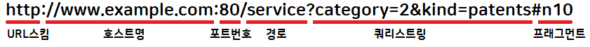

# Django

# HTTP 프로토콜

웹 서버와 웹 클라이언트 사이에서 데이터를 주고받기 위해 사용하는 통신방식으로, TCP/IP 프로토콜 위에서 동작한다.

## HTTP 메시지의 구조

HTTP 메시지는 클라이언트에서 서버로 보내는 요청 메시지와 서버에서 클라이언트로보내는 응답 메시지 2가지가 있다. 그 구조는 아래와 같다.

- 스타트라인: 요청라인 또는 상태라인
- 헤더: 헤더는 생략 가능
- 빈 줄: 헤더의 끝을 빈 줄로 식별
- 바디: 바디는 생략 가능

스타트라인은 요청 메시지일 때 요청라인이라 하고, 응답 메시지일 때 상태라인이라고 한다.

헤더는 각 행의 끝에 줄 바꿈 문자인 CRLF가 있으며, 헤더와 바디는 빈 줄로 구분한다.

바디에는 텍스트뿐만 아니라 바이너리 데이터도 들어갈 수 있다.

- 바디가 없는 요청 메시지

```bash
GET /book/shakespeare HTTP/1.1
HOST: www.example.com:8080
```

`첫 번째 줄: 요청라인`으로, `요청 방식(method)`, `요청 URL`, `프로토콜 버전`으로 구성된다.

`두 번째 줄: 헤더`로, `이름: 값` 형식으로 표현하며, 여러 줄도 가능하다. 또한, `HOST` 항목은 필수로 표시해줘야 한다. 요청라인의 URL에 HOST를 표시하면 HOST 헤더는 생략할 수 있다. PORT 번호 또한 같이 표시.

```bash
GET http://www.example.com:8080/book/shakespeare HTTP/1.1
```

- 응답 메시지

```bash
HTTP/1.1 200 OK
Content-Type: application/xhtml+xml; charset=utf-8

<html>
...
</html>
```

`첫 번째 줄: 상태라인`은 `프로토콜 버전`, `상태 코드`, `상태 텍스트`로 구성된다. 서버에서 처리 결과를 상태라인에 표시한다.

`두 번째 줄: 헤더`로 예시에서는 헤더가 하나뿐인 응답 메시지로, 바디가 있어 빈 줄로 구분한다.

> URI vs URL
URI는 Uniform Resource Indentifier 의 약자로 URL(Uniform Resource Locator)와 URN(Uniform Resource Name)을 포함하는 더 넓은 의미의 표현

## HTTP 처리 방식

HTTP 메소드를 통해서 클라이언트가 원하는 처리 방식을 서버에 알려준다.

- GET: 리소스 취득
- POST: 리소스 생성, 리소스 데이터 추가
- PUT: 리소스 변경
- DELETE: 리소스 삭제
- HEAD: 리소스의 헤더(메타데이터) 취득
- OPTIONS: 리소스가 서포트하는 메소드 취득
- TRACE: 루프백 시험에 사용
- CONNECT: 프록시 동작의 터널 접속으로 변경

html 폼에서 사용자가 입력한 데이터를 서버로 보낼 때, GET또는 POST 메소드를 사용한다. Django의 경우 폼의 데이터는 POST 방식만을 사용한다. 

## 상태 코드

서버에서의 처리 결과는 응답 메시지의 상태라인에 있는 상태 코드를 보고 파악할 수 있다.

상태 코드는 세 자리 숫자로, 첫 번째 숫자는 HTPP 응답의 종류를 구분, 나머지 두 개의 숫자는 세부 응답 내용을 구분한다.

- 1xx Informational 임시적인 응답으로, 현재 클라이언트의 요청까지 처리되었으니 계속 진행바람
- 2xx Success 클라이언트의 요청이 서버에서 성공적으로 처리되었음
- 3xx Redirection 완전한 처리를 위해서 추가적인 동작을 필요로 함. 주로 서버의 주소 또는 요청한 URI의 웹 문서가 이동되었으니, 그 주소로 다시 시도해보라는 의미
- 4xx Client Error 없는 페이지를 요청하는 것처럼 클라이언트의 요청 메시지 내용이 잘못된 경우
- 5xx Server Error 서버 측 사정에 의해 메시지 처리에 문제가 발생한 경우. 서버의 부하, DB 처리 오류, 서버 익셉션 발생 등

## URL 설계



- URL 스킴: URL에 사용된 프로토콜
- 호스트명: 웹 서버의 호스트명으로, 도메인명 또는 IP 주소로 표현
- 포트번호: 웹 서버 내의 서비스 포트번호. 생략 시 디폴트 포트번호로, http는 80, https는 443
- 경로: 파일이나 애플리케이션 경로를 의미
- 쿼리스트링: 질의 문자열로, `&`로 구분된 `이름=값` 쌍 형식으로 표현
- 프래그먼트: 문서 내의 앵커 등 조각을 지정

## RPC와 REST

URL은 웹 클라이언트에서 호출한다는 시점에서 웹 서버에 존재하는 애플리케이션에 대한 API

API의 명명 규칙을 정하는 방법으로 URL을 RPC로 보는 방식과 REST로 바라보는 방식이다

### RPC(Remote Procedure Call)

클라이언트가 네트워크상에서 원격에 있는 서버가 제공하는 API 함수를 호출하는 방식

URL 설계와 API 설계를 동일하게 고려하여 URL의 경로를 API 함수명으로, 쿼리 파라미터를 함수의 인자로 간주한다. 때문에, 웹 클라이언트에서 URL을 전송하는 것이 웹 서버의 API 함수를 호출한다고 인식한다. URL 경로가 동사(함수) 의 형태를 띔

```bash
http://blog.example.com/search?q=test&debug=true
```

### REST(Representational State Transfer)

웹 서버에 존재하는 요소들을 모두 리소스로 정의. URL을 통해 웹 서버의 특정 리소스를 표현하는 개념으로 클라이언트와 서버 간에 데이터의 교환을 리소스 상태의 교환으로 간주. 리소스의 조작을 HTTP 메소드로 구분한다.

```bash
http://blog.example.com/search/test              # GET 메소드의 사용으로 REST가 인식
```

## 파이썬의 Elegant URL

REST 방식의 URL 개념을 기반으로 간편 URL 체계를 도입하였다. 쿼리스트링 없이 경로만 가진 구조

그 외에도 URL을 정의하기 위해 정규표현식을 추가적으로 사용할 수 있다.

```python
urlpatterns = [
		path('articles/2003/', views.special_case_2003),
		path('articles/<int:year>/', views.year_archive),
		path('articles/<int:year>/<int:month>', views.month_archive),
		path('articles/<int:year>/<int:month>/<slug:slug>/', views.article_detail),
]
```

정규 표현식을 사용해서 URL을 좀 더 구체적으로 표현 할 수 있다. year를 4자리, month를 2자리로 제한

```python
urlpatterns = [
		path('articles/2003/', views.special_case_2003),
		re_path(r'^articles/(?P<year>[0-9]{4})/$', views.year_archive),
		re_path(r'^articles/(?P<year>[0-9]{4})/(?P<month>[0-9]{2})/$', views.month_archive),
		re_path(r'^articles/(?P<year>[0-9]{4})/(?P<month>[0-9]{2})/(?P<slug>[\w-]+)/$', views.article_detail),
]
```

## 웹 서버

웹 클라이언트의 요청을 받아서 요청을 처리하고, 그 결과를 웹 클라이언트에게 응답. 주로 정적 페이지를 웹 클라이언트에 제공할 때 웹 서버를 사용한다. 동적 페이지 처리가 필요하다면 웹 애플리케이션 서버에 처리를 넘긴다. ex) Apache httpd, Nginx, lighttpd, IIS 등

## 애플리케이션 서버

웹 서버로부터 동적 페이지 요청을 받아 요청을 처리하고, 그 결과를 웹 서버로 반환. 주로 동적 페이지 생성으 ㄹ위한 프로그램 실행과 데이터베이스 연동을 처리 ex) Apache Tomcat, JBoss, Jetty 등

# CGI(Common Gateway Interface)

# 웹 라이브러리 구성

`urllib 패키지`에는 웹 클라이언트를 작성하는 데 사용되는 모듈들이 있으며, `http 패키지`는 크게 서버용과 클라이언트용 라이브러리로 나누어 모듈을 담고 있다. 쿠기 관련 라이브러리도 http 패키지 내에서 서버용과 클라이언트용으로 모듈이 구분되어 있다.

웹 클라이언트를 개발하는 경우에는 주로 urllib 패키지를 사용한다. http.client 모듈이 HTTP 프로토콜 처리와 관련된 저수준의 클라이언트 기능을 제공하는 반면, urllib 패키지의 모듈들은 HTTP 서버뿐만 아니라 FTP 서버 및 로컬 파일 등을 처리하는데, 클라이언트에서 필요한 함수와 클래스 등을 제공한다. 주로 URL 처리와 서버 액세스 관련 API를 제공하고 있으며, HTTP 프로토콜과 관련해서는 http.client 모듈의 API를 한번더 추상화 하여 고수준의 API를 제공한다.

# 파이썬 기본 라이브러리 클라이언트

## urllib.parse 모듈

URL의 분해, 조립, 변경 및 URL 문자 인코딩, 디코딩 등을 처리하는 함수를 제공한다. 

```python
from urllib.parse import urlparse
result = urlparse("http://www.python.org:80/guido/python.html;philosophy?overall=3#n10")
"""
ParseResult(scheme='http',
						 netloc='www.python.org:80',
						 path='/guido/python.html',
					   params='philosophy',
						 query='overall=3',
						 fragment='n10')
"""
```

urlparse() 함수는 URL을 파싱한 결과로 ParseResult 인스턴스를 반환한다.

- scheme URL에 사용된 프로토콜
- netloc 네트워크 위치 user:password@host:port 형식이며, HTTP 프로토콜의 경우 host:port
- path 파일이나 애플리케이션 경로
- params 애플리케이션에 전달될 매개변수 deplocated
- query 질의 문자열 또는 매개변수. `이름=값`쌍 형식으로 표현
- fragment 문서 내의 앵커 등 조각 지정

# 파이썬 기본 라이브러리 서버

## CGI

웹 서버와 애플리케이션 간에 데이터를 주고받기 위한 규격을 CGI(Common Gateway Interface)라고 한다. 파이썬 표준 라이브러리에서는 이러한 CGI 처리를 할 수 있도록 cgi 모듈과 cgitb 모듈을 제공한다. cgi 모듈은 요청에 포함된 파라미터를 처리하기 위한 FieldStorage 클래스를 정의, cgitb 모듈은 CGI 애플리케이션(스크립트)을 실행하는 과정의 에러에 대한 상세 표시

파이썬은 WSGI 기술을 사용하여 CGI 처리를 하므로 cgi 모듈을 잘 사용하지 않는다.

## WSGI

CGI 방식은 요청이 들어올 때마다 처리를 위한 프로세스가 생성되는 방식이기 때문에, 순간에 대량의 요청을 받으면 서버 부하가 높아져 문제가 발생할 수 있다. 이러한 단점을 해결하고 파이썬 언어로 애플리케이션을 쉽게 작성할 수 있도록 웹 서버와 웹 애플리케이션 간에 연동 규격을 정의한 것이 WSGI 규격이다.

Django로 웹 애플리케이션을 작성하면, Apache 웹 서버에서도 실행할 수 있고, Nginx 웹 서버로도 실행할 수 있다. 그러나 이 둘은 범용 웹 서버로, WSGI 처리 기능이 없다. 때문에 웹 서버와 파이썬 웹 애플리케이션 중간에서 WSGI 통신 규격을 처리해주는 mod_wsgi, uWSGI, Gunicorn 같은 WSGI서버가 필요하다.

### WSGI  서버의 애플리케이션 처리과정

웹 서버에서 클라이언트의 요청을 받아 WSGI 서버로 처리를 위임하고, WSGI 서버는 애플리케이션을 실행하여 그 결과를 웹 서버에게 되돌려주면, 웹 서버는 클라이언트에게 응답하는 순서로 되어있다.

1. Request
2. 웹서버 : Request 의 URL 분석
3. 웹서버 : WSGIScriptAlias 에 정의된 URL이라면, WSGI 서버에 처리 위임
4. 파라미터 전달
5. WSGI 서버 : WSGIScriptAlias 에 정의된 [wsgi.py](http://wsgi.py) 를 실행
6. application(environ, start_response) 함수 호출
7. call
8. apllication : 환경변수 처리
9. apllication : 뷰처리, HTTPReques 객체 생성
10. apllication : start_response() 함수 호출
11. return HTTPResponse
12. 애플리케이션에서 WSGI서버로 return 
13. 표준 출력에 결과 출력
14. 처리결과를 웹서버에 전달
15. 클라이언트에게 Response

WSGI 규격에 따라 애플리케이션을 개발할 때 중요한 사항 세가지

1. 개발이 필요한 애플리케이션을 함수 또는 클래스의 메소드로 정의하고, 애플리케이션 함수의 인자를 정의한다.

`def application_name(environ, start_response) :`

- environ : 웹 프레임워크에 이미 정의되어있음, HTTP_HOST, HTTP_USER_AGENT, SERVER_PROTOCOL과 같은 HTTP 환경변수
- start_response : 애플리케이션 내에서 응답을 시작하기 위해 반드시 호출해야 하는 함수

2. start_response 함수의 인자 역시 정해져 있으므로 따른다.

`start_response(status, headers)`

- status : 응답 코드 및 응답 메시지를 지정한다.
- headers : 응답 헤더를 지정한다.

3. 애플리케이션 함수의 리턴 값은 응답 바디에 해당하는 내용으로, 리스트나 제너레이터와 같은 iterable 타입이어야 한다.

# Django 웹 프레임워크

로렌스 저널-월드 신문을 만들던 웹 개발팀의 내부 프로젝트로 시작되었다. 2005년 오픈소스 프로젝트로 공개되고 구글의 앱 엔진에서 장고를 사용하면서 인기가 시작

## 장고의 특징

- MVC 패턴 기반의 MVT

장고에서 Model은 데이터베이스에 액세스하는 컴포넌트이고, View는 데이터를 가져오고 변형하는 컴포넌트이며 Template은 데이터를 사용자에게 보여주는 컴포넌트 이다.

- 객체 관계 매핑

장고의 객체 관계 매핑은 데이터베이스 시스템과 모델이라는 파이썬 클래스를 연결시키는 다리와 같은 역할을 한다. ORM 기능을 통해 다양한 데이터베이스 시스템을 지원하고 있으며, SQL 문장을 사용하지 않고도 테이블을 조작할 수 있다. 이미 구축한 데이터베이스 시스템을 다른 데이터베이스로 변경하는 경우에도 간단하다.

- 자동으로 구성되는 관리자 화면

장고는 웹 서버의 콘텐츠, 즉 데이터베이스에 대한 관리 기능을 위하여 프로젝트를 시작하는 시점에 기본 기능으로 관리자 화면을 제공한다. 이러한 관리자 화면을 통해서 애플리케이션에서 사용하는 테이블과 데이터들을 쉽게 생성하거나 변경할 수 있으며, 개발자가 별도로 관리 기능을 개발할 필요가 없어졌다.

- 우아한 URL

URL을 직관적이고 쉽게 표현할 수 있다. 정규표현식을 사용하여 복잡한 URL도 표현할 수 있으며, 각 URL 형태를 파이썬 함수에 1:1로 연결하도록 되어있어 개발이 편리하고 이해가 쉽다.

- 자체 템플릿 시스템

장고는 내부적으로 확장이 가능하고 디자인이 쉬운 강력한 템플릿 시스템을 가지고 있다. 이를 통해 화면 디자인과 로직에 대한 코딩을 분리하여 독립적으로 개발 진행이 가능하다. 장고의 템플릿 시스템은 HTML과 같은 텍스트형 언어를 쉽게 다룰 수 있도록 개발되었다.

- 캐시 시스템

동적인 페이지를 만들기 위해서 데이터베이스 쿼리를 수행하고 템플릿을 해석하며, 관련 로직을 실행해서 페이지를 생성하는 일은 서버에 부하가 많다. 그래서 캐시 시스템을 사용하여 자주 이용되는 내용을 저장해 두었다가 재사용하면 성능을 높일 수 있다.

장고의 캐시 시스템은 캐시용 페이지를 메모리, 데이터베이스 내부, 파일 시스템 중 아무 곳에나 저장할 수 있다. 또한 캐시 단위를 페이지에서부터 사이트 전체 또는 특정 뷰의 결과, 템플릿의 일부 영역만을 지정하여 저장해 둘 수 있다.

- 다국어 지원

장고는 동일한 소스코드를 다른 나라에서도 사용할 수 있도록 텍스트의 번역, 날짜/시간/숫자의 포맷, 타임존의 지정 등과 같은 다국어 환경을 제공한다.

- 풍부한 개발 환경

장고는 개발에 도움이 될 수 있는 여러 가지 기능을 제공한다. 대표적으로 테스트용 웹 서버를 포함하고 있다.

- 소스 변경사항 자동 반영

개발 과정에서 장고는 *.py 파일의 변경 여부를 감시하고 있다가 변경이 되면 실행 파일에 변경 내역을 바로 반영해준다. 그래서 테스트용 서버를 실행 중인 상태에서 소스 파일을 수정하면 자동으로 새로운 파일이 반영된다.

## MVT 패턴

예를 들어, 모델은 블로그 내용을 데이터베이스로부터 가지고 오거나 저장, 수정하는 기능을 한다.

뷰는 버튼을 눌렀을 때 어떤 함수를 호출하며 ㅇ데이터를 어떻게 가공할 것인지 결정하는 역할

템플릿은 화면 출력을 위해 디자인과 테마를 적용해서 보여지는 페이지를 만들어주는 역할

이미지

웹 클라이언트의 요청을 받아 장고에서 MVT 패턴에 따라 처리하는 과정

1. 클라이언트로부터 요청을 받으면 `URLconf`를 이용하여 URL을 분석한다.
2. URL 분석 결과를 통해 해당 URL에 대한 처리를 담당할 `View`를 결정한다.
3. View는 자신의 로직을 실행하면서, 만일 데이터베이스 처리가 필요하면 `Model`을 통해 처리하고 그 결과를 리턴 받는다.
4. 뷰는 자신의 로직 처리가 끝나면 `Template`을 사용하여 클라이언트에 전송할 HTML 파일을 생성한다.
5. 뷰는 최종 결과물로 HTML 파일을 클라이언트에게 보내 응답한다.

## Model - 데이터베이스 정의

사용될 데이터에 대한 정의를 담고 있는 장고의 클래스로 장고는 ORM 기법을 사용하여 애플리케이션에서 사용할 데이터베이스를 클래스로 매핑하여 코딩할 수 있다. 

하나의 모델 클래스는 하나의 테이블에 매핑되고, 모델 클래스의 속성은 테이블의 칼럼에 매핑된다.

```python
from django.db import models

class Person(models.Model):
		first_name = models.CharField(max_length=30)
		last_name = models.CharField(max_length=30)
```

장고는 테이블 및 컬럼을 자동으로 생성하기 위해 필요한 많은 규칙을 가지고 있다.  위의 예는 다음의 규칙이 적용되었다.

- 테이블명은 애플리케이션명과 모델 클래스명을 밑줄(_)로 연결하고, 모두 소문자로 표시한다.
- Primary Key는 Person 클래스에서 정의하지 않아도 장고에서 자동으로 부여된다.

**장고 모델 클래스의 규칙**

[https://docs.djangoproject.com/en/2.1/topics/db/models/](https://docs.djangoproject.com/en/2.1/topics/db/models/)

장고 모델 클래스 - 몽고디비

[https://django-mongodb-engine.readthedocs.io/en/latest/tutorial.html](https://django-mongodb-engine.readthedocs.io/en/latest/tutorial.html)

> ORM(Object-Relational-Mapping)
쉽게 말해 객체와 관계형 데이터베이스를 연결해주는 역할을 한다. 데이터베이스 대신 객체(클래스)를 사용해 데이터를 처리할 수 있다.객체를 대상으로 필요한 작업을 실행하면, ORM이 자동으로 적절한 SQL 구문이나 데이터베이스 API를 호출해서 처리해주기 때문이다.

## URLconf - URL 정의

클라이언트로부터 요청을 받으면 장고는 가장 먼저 요청에 들어있는 URL을 분석한다. 즉, 요청에 들어있는 URL이 [urls.py](http://urls.py) 파일에 정의된 URL 패턴과 매칭되는지 확인한다.

웹 클라이언트가 웹 서버에 페이지 요청 시, 장고에서 URL을 분석하는 순서

- [setting.py](http://setting.py) 파일의 ROOT_URLCONF 항목을 읽어 최상위 URLconf 의 위치를 알아낸다.
- URLconf를 로딩하여 urlpatterns 변수에 지정되어 있는 URL 리스트를 검사
- 위에서부터 순서대로 URL 리스트의 내용을 검사하면서 URL 패턴이 매치되면 검사 종료
- 매치된 URL의 뷰를 호출한다. (뷰는 함수 또는 클래스의 메소드) 호출 시 HttpRequest 객체와 매칭할 때 추출된 단어들을 뷰에 인자로 넘겨준다.
- URL 리스트를 끝까지 검사했는데 매칭에 실패하면 에러를 처리하는 뷰를 호출한다.

URL 패턴을 정의할 때 꺾쇠를 이용하는 것은 URL 패턴의 일부 문자열을 추출하기 위한 것이며, `<type:name>`형식으로 사용한다. 또한, 매치된 경우에는 매치된 내용을 인자명에 할당한다.

```python
path('articles/<int:year>/', views.special_case_2020)
```

위의 경우에 요청 URL이 articles/2020 인 경우 뷰 함수를 views.special_case_2020(request, year=2020) 처럼 호출한다. views 에서 year 파라메터 처럼 이용할 수 있단 뜻

꺾쇠 부분을 장고에서는 Path Converter라고 부르며, 다양한 타입을 사용할 수 있다

- str 슬래시를 제외한 모든 문자열. 타입 미지정시 디폴트
- int 0 또는 양의 정수 매칭시 python int형 변환
- slug slug형식의 문자열 (ASCII, 숫자, 하이픈, 밑줄로만 구성됨) 과 매치
- uuid UUID 형식의 문자열과 매치, 매칭시 python UUID 형 변환
- path 슬래시를 포함한 모든 문자열과 매치.

## View - 로직 정의

장고는 웹 요청의 URL을 분석하고, 그 결과로 해당 URL에 매핑된 뷰를 호출한다.

뷰는 웹 요청을 받아서 데이터베이스 접속 등 해당 애플리케이션의 로직을 처리하고, 그 결과 데이터를 HTML로 변환하기 위하여 템플릿 처리를 한 후에, 최종 HTML로 된 응답 데이터를 웹 클라이언트로 리턴한다.

뷰 함수는 첫 번째 인자로 HttpRequest 객체 (보통 파라미터를 request 또는 req로 명명)를 받는다. 그리고 로직 처리 후 최종적으로 HttpResponse 객체를 반환한다.

에러를 반환하고 싶다면 HttpResponseNotFound와 같은 에러 응답 객체를 반환하면 된다. 에러 응답 클래스는 모두 HttpResponse 클래스의 하위 클래스로 정의되어 있다.

## Template - 화면 UI 정의

장고가 클라이언트에게 반환하는 최종 응답은 HTML 텍스트이다. 개발자가 작성하는 *.html 파일을 템플릿이라 하며, 여기에 화면 UI를 템플릿 문법에 맞게 작성한다.

장고에서 제공하는 템플릿은 템플릿 태그/필터 기능을 사용하여 파이썬 코드를 직접 사용할 수 있어확장이 쉽다.

장고에서 템플릿 파일을 찾을 때는 TEMPLATES 및 INSTALLED_APPS에서 지정된 앱의 디렉토리를 검색한다. 이 항목들은 프로젝트 설정 파일인 [settings.py](http://settings.py) 파일에 정의되어 있다.

여러 개의 디렉토리를 지정한 경우, 지정된 순서대로 디렉토리를 검색하여 템플릿 파일을 찾는다.

settings.py의 TEMPLATE 항목에 정의된 디렉토리를 먼저 찾고, INSTALLED_APPS 항목에 등록 된 각 앱의 templates 디렉토리를 찾는다.

## MVT 코딩 순서

장고에서 코딩 정해진 코딩 순서는 없다. 다만, 함수형 뷰를 사용할때는 모델, 템플릿, 뷰 순서로 클래스형 뷰를 사용할때는 모델, 뷰, 템플릿 순서로 진행하면 편하다.

**함수형 뷰를 사용하는 코딩 순서**

- 프로젝트 뼈대 만들기 : 프로젝트 및 앱 개발에 필요한 디렉토리와 파일 생성
- 모델 코딩 : 테이블 관련 사항을 개발(models.py, admin.py 파일)
- URLconf 코딩하기 : URL 및 뷰 매핑 관계를 정의(urls.py 파일)
- 템플릿 코딩하기 : 화면 UI 개발 (templates/디렉토리 하위의 *.html 파일들)
- 뷰 코딩 : 애플리케이션 로직 개발(views.py 파일)

# 장고에서 프로젝트와 애플리케이션

프로젝트란 개발 대상이 되는 전체 프로그램을 의미하며, 프로젝트를 몇 개의 기능 그룹으로 나누었을 때, 프로젝트 하위의 서브 프로그램을 애플리케이션이라고 한다.

애플리케이션 단위로 모아서 프로젝트를 만들고, 프로젝트를 모아서 더 큰 프로젝트를 만드는 방식으로 계층적인 웹 프로그램 개발이 가능하다는 장점이 있다.

> 프로젝트와 애플리케이션 모두 파이썬 디렉토리에 해당하는데, 파이썬에서는 __init__.py 파일이 존재하는 디렉토리를 패키지라고 한다. 파이썬 3.3 부터는 init파일이 없어도 패키지로 인식한다.

## 프로젝트 생성

pip install django 필요!

1. 가장 처음 명령으로 mysite 라는 프로젝트를 생성한다. 프로젝트 명은 지정가능

```bash
django-admin startproject 프로젝트이름
```

2. 프로젝트를 생성하면 안에 첫번째 애플리케이션과 프로젝트 디렉토리의 이름이 같다. 혼동 주의 변경 추천

## 프로젝트 안에서 애플리케이션 생성

```bash
python manage.py startapp 앱네임
```

### 프로젝트 설정 파일 변경

프로젝트에 필요한 설정값들은 [settings.py](http://settings.py) 파일에 지정한다. settings.py 파일은 프로젝트의 전반적인 사항들을 설정해주는 곳으로, 루트 디렉토리를 포함한 각종 디렉토리의 위치, 로그의 형식, 프로젝트에 포함된 애플리케이션의 이름 등이 지정되어 있다.

### 1. ALLOWED_HOSTS

장고는 DEBUG=True 이면 개발 모드로, False 이면 운영 모드로 인식한다. 운영 모드인 경우에는 AWLLOWED_HOSTS에 반드시 서버의 IP나 도메인을 지정해야 하고, 개발 모드인 경우에는 값을 지정하지 않아도 localhost 127.0.0.1로 간주한다.

### 2. 프로젝트에 포함되는 애플리케이션들은 모두 설정 파일에 등록

위의 예제에서 새로 만든 polls 또한 등록해야 한다. 애플리케이션을 등록할 때는 간단히 애플리케이션의 모듈명인 'polls'만 등록해도 되지만 애플리케이션 설정 클래스로 등록하는 것이 더 정확한 방법이다.

앱의 설정 클래스는 startapp appname 명령 시 자동 생성된 `apps.py`파일에 appnameConfig 라고 정의되어있다. 따라서 장고가 설정 클래스를 찾을 수 있도록 모듈 경로까지 포함하여 `'appname.apps.appnameConfig'` 라고 등록한다.

### 3. 프로젝트에 사용할 데이터베이스 엔진 설정

장고는 디폴트로 SQLite3 데이터베이스 엔진을 사용하도록 설정되어 있다. 데이터베이스를 변경하기 위해서는 `setting.py`파일에서 수정

### 4. 타임존 지정

최초에는 세계표준시(UTC)로 되어있다. 한국 시간으로 변경한다 `TIME_ZONE = 'Asia/Seoul'`

일광절약시간제 가 자동으로 계산되므로 USE_TZ=False 설정을 추천

## 기본 테이블 생성

기본 테이블 생성을 위해 명령을 내린다. migrate 명령은 데이터베이스에 변경사항이 있을 때 이를 반영해주는 명령이다.

```bash
python manage.py migrate
```

장고는 모든 웹 프로젝트 개발 시 반드시 사용자와 그룹 테이블 등이 필요하다는 가정 하에 설계되었다. 때문에 테이블을 전혀 만들지 않았더라도, 사용자 및 그룹 테이블 등을 만들어주기 위해 프로젝트 개발 시작 시점에 이 명령을 실행한다. 명령을 실행하면 migrate 명령에 대한 로그가 보이고, 실행 결과로 SQLite3 데이터베이스 파일인 db.sqlite3 파일이 생성된다.

# 테스트 서버 실행

python의 `manage.py` 를 통해 `runserver`라고 하는 간단한 테스트용 웹 서버를 제공해준다.

```bash
python manage.py runserver 0.0.0.0:8000 # 또는 0:8000
```

0.0.0.0 의 의미는 현재 명령을 실행 중인 서버의 IP주소가 무엇이더라도 접속을 허용.

디폴트 주소는 127.0.0.1 포트 8000

## 기본 제공하는 관리자 페이지

장고 서버를 실행한 URL의 /admin 에 접속한다. 로그인하려면  Username과 Password가 필요하다.

**슈퍼 유저 만들기**

```bash
python manage.py createsuperuser
```

admin 화면에서 기본적으로 Users와 Groups 테이블이 보이는 이유는 [settings.py](http://settings.py) 에 django.contrib.auth 애플리케이션이 기본 등록되어 있기 때문이다.

# 애플리케이션 개발 - Model

모델 작업은 데이터베이스에 테이블을 생성하는 작업이다. 예제를 보자

1. models.py 작성. 테이블을 정의한다.
2. admins.py 작성. 정의된 테이블이 Admin 화면에 보이게 한다.
3. `python manage.py makemigrations` 데이터베이스에 변경이 필요한 사항을 추출
4. `python manage.py migrate` 데이터베이스에 변경사항을 반영
5. `python manage.py runserver` 작업 확인

## 테이블 정의

애플리케이션에서 필요한 테이블의 정의는 `models.py` 파일에 작성한다.

```python
# 예제 Question 과 Choice 테이블 작성
from django.db import models

class Question(models.Model):
    question_text = models.CharField(max_length=200)
    pub_date = models.DateTimeField('date published')
    
    def __str__(self):
        return self.question_text
    
class Choice(models.Model):
    question = models.ForeignKey(Question, on_delete=models.CASCADE)
    choice_text = models.CharField(max_length=200)
    votes = models.IntegerField(default=0)
    
    def __str__(self):
        return self.choice_text

```

테이블을 하나의 클래스로 정의하고, 테이블의 컬럼은 클래스의 변수(속성)로 매핑한다.

테이블 클래스는 반드시 `django.db.models.Model`클래스를 상속받아 정의하고, 각 클래스 변수의 타입도 장고에서 미리 정의된 필드 클래스를 사용한다.

- PK : 클래스에 지정해주지 않아도, 장고는 항상 PK에 대한 속성을 Not Null 및 Autoincrement 이름은 id로 해서 자동으로 만든다.
- DateTimeField() 필드 클래스에 정의한 date published 는 pub_date 컬럼에 대한 레이블 문구
- FK : 항상 다른 테이블의 PK에 연결되므로, Question 클래스의 id 변수까지 지정할 필요 없이 Question 클래스만 지정하면 된다. 실제 테이블에서 FK 컬럼은 _id 접미사가 붙는다.
- __str__() 스페셜 메소드를 작성하지 않으면 테이블명이 제대로 표시되지 않는다.

## Admin 사이트에 테이블 반영

`models.py` 파일에서 정의한 테이블을 Admin 사이트에 보이도록 등록. `admin.py`에 등록한다.

```python
from django.contrib import admin
from .models import Choice, Question

admin.site.register(Choice)
admin.site.register(Question)
```

## 데이터베이스 변경 사항 반영

테이블의 신규 생성, 테이블의 정의 변경 등 데이터베이스에 변경한 필요한 사항이 있으면 이를 반영하는 마이그레이션 작업이 필요하다.

```python
ptyhon manage.py makemigrations
python manage.py migrate
```

makemigrations 명령에 의해 migrations 디렉토리 하위에 마이그레이션 파일들이 생기고 migrate 명령으로 데이터베이스에 테이블을 만들어준다.

# 애플리케이션 개발 - View 및 Template

URL과 뷰는 1:1 관계로 매핑된다. (N:1 도 가능) 이러한 URL/뷰 매핑을 URLconf 라고하며 `urls.py` 파일에 작성한다.

로직의 흐름상 URLconf 를 먼저 코딩한 후 뷰, 템플릿 또는 템플릿, 뷰 순서로 코딩한다.

`path()` 함수는 매우 중요하다. route, view 2개의 필수 인자와, kwargs, name 2개의 선택 인자를 받는다.

- route : URL 패턴을 표현하는 문자열.  URL 스트링이라고도 함
- view : URL 스트링이 매칭되면 호출되는 뷰 함수. HttpRequest 객체와 URL 스트링에 추출된 항목이 뷰 함수의 인자로 전달된다.
- kwargs : URL 스트링에서 추출된 항목 외에 추가적인 인자를 뷰 함수에 전달할 때, 파이썬 사전 타입으로 인자를 정의한다.
- name : 각 URL 패턴별로 이름을 붙인다. 보통 템플릿 파일에서 많이 사용된다.

만일 요청 URL이 /admin/ 이라면 아래에 매칭된다. admin.site.urls 함수가 호출된다. (장고기능)

```python
path('admin/', admin.site.urls),
```

만일 `/seoyul/` 이라면 아래와 같고 URL 스트링에서 추출되는 항목이 없어 `views.index(request)` 처럼 뷰 함수가 호출된다. 이 URL 패턴의 이름을 index 라고 정했다. 함수 호출에 `()` 없음 주의

```python
path('seoyul', views.index, name='index'),
```
